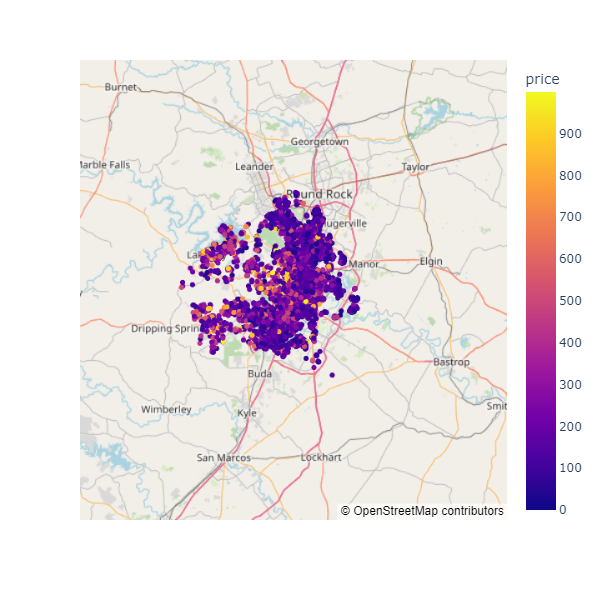
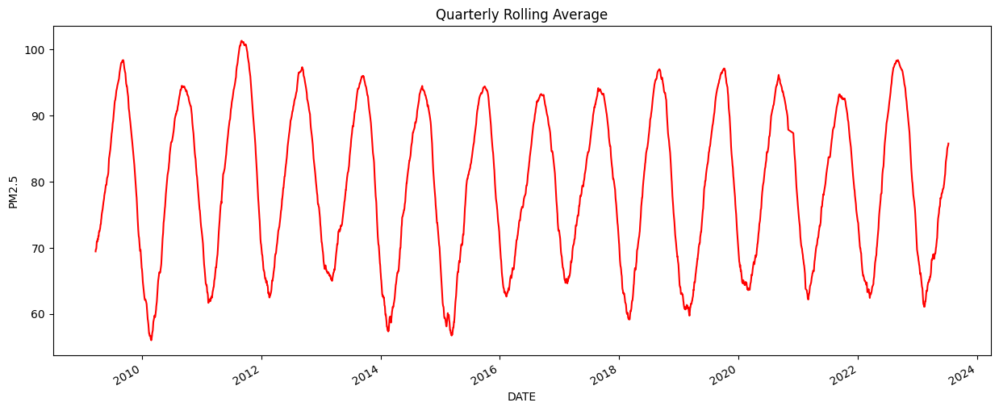
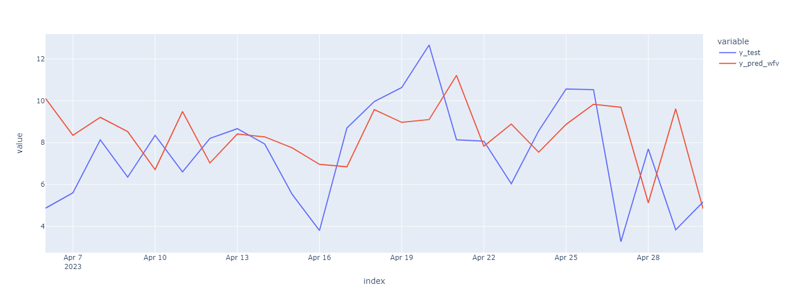
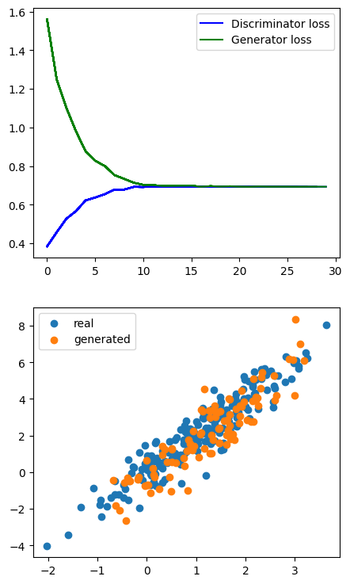

# My Projects

##### This page is created to record all of my Data Science's Projects. Please refer this [website: khai.one](https://khai.one/) for creative computing projects

---
## [Austin_Air_BnB_price_per_night_prediction](https://github.com/Khaihuyennguyen/Austin_Air_BnB_price_per_night_prediction)

Location, location, location
---

---
## [Eat-Out-Worry-Free](https://eat-out-worry-free.streamlit.app/)

An awesome tool for you to order when you on diet and eating out!
---

---
## [Austin Temperature Time Series Prediction](https://github.com/Khaihuyennguyen/Austin_Temp_Linear_Regression)

Exploring the time series data from https://www.ncei.noaa.gov/ for highest temperature in Austin, Texas. This also create linear model to predict temperature readings.
---

---
## [Time Series: ARMA_Models_PM2.5_Austin](https://github.com/Khaihuyennguyen/ARMA_Model_PM2.5_Austin/tree/main)

Obtained the air quality data for Austin, which includes pollutants like PM2.5, from reliable sources https://aqs.epa.gov/aqsweb/documents/data_api.html. My project demonstrated a thorough and systematic approach to analyzing air quality data using time series models. I covered critical aspects of the analysis, including data preparation, modeling, and evaluation. My insights can be valuable for understanding air quality trends in Austin and potentially for making informed predictions. I'm pleased with completing such a comprehensive project!
---

---
## [Dataset Augmentation with GAN](https://github.com/Khaihuyennguyen/Dataset_Augmentation_with_GANs)

Developed a GAN from scratch using PyTorch and Matplotlib for dataset augmentation, optimizing generator's output distribution with automatic differentiation to enhance AI model performance through data enrichment

#### [Education Project]

---

